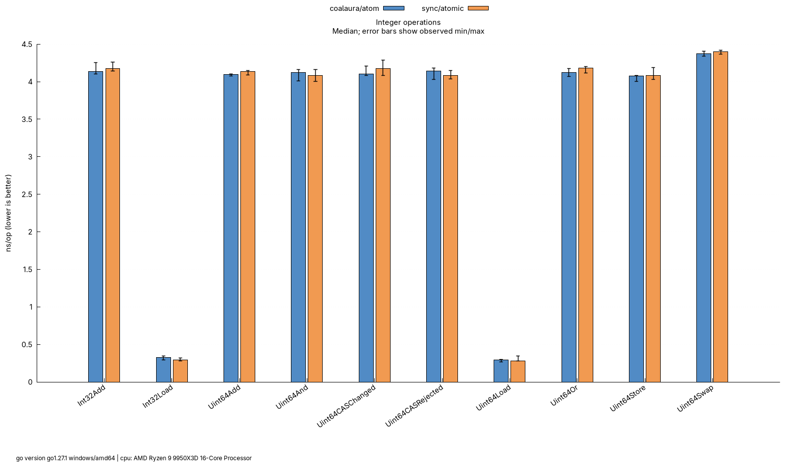
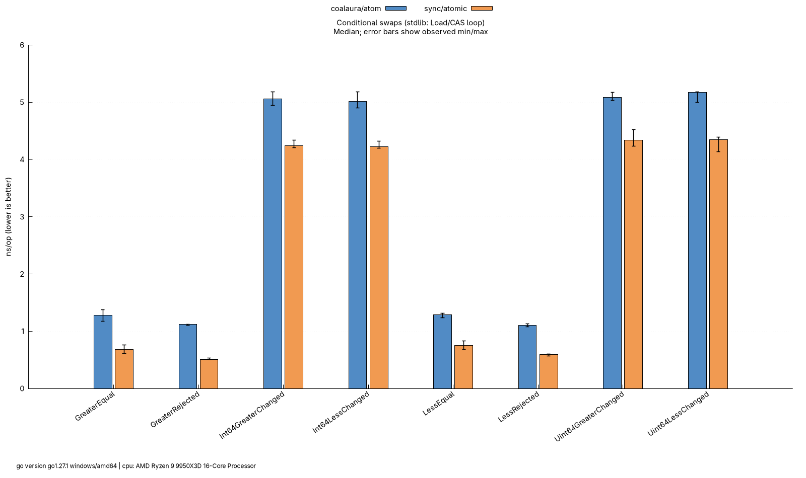
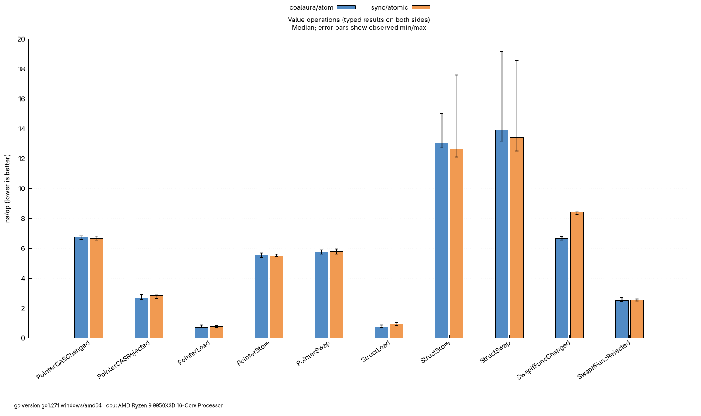
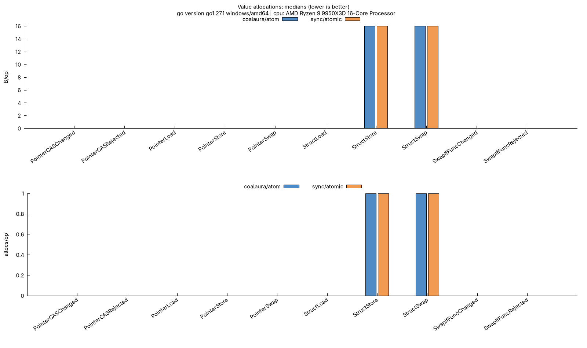
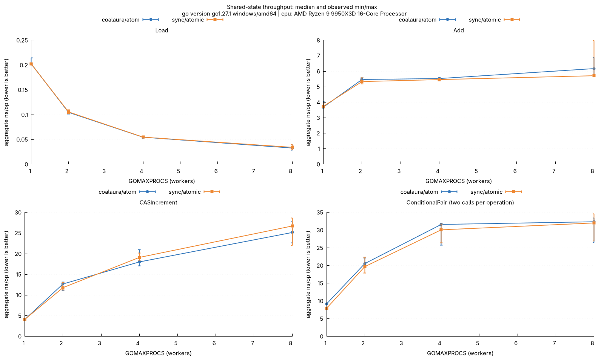

# Benchmarks

Paired comparisons between `github.com/coalaura/atom` and equivalent `sync/atomic` code, with raw Go benchmark output and gnuplot charts. The suite requires Go 1.24 or newer for `testing.B.Loop`; older Go versions skip these benchmark files without changing the library's minimum Go version.

## Run and render

From the repository root, with Go and gnuplot (including the `pngcairo` terminal) on `PATH`:

```sh
go run ./bench/cmd/bench
```

The runner measures serial cases with `GOMAXPROCS=1` and shared-state cases with `GOMAXPROCS=1,2,4,8`. By default it collects five 200 ms samples per case, alternating the two implementations within each suite repetition. Allow a few minutes on an otherwise idle machine.

```sh
# Longer samples, more repetitions, and additional worker counts.
go run ./bench/cmd/bench -benchtime=1s -count=10 -cpu=1,2,4,8,16

# Collect data without requiring gnuplot on the benchmark machine.
go run ./bench/cmd/bench -plot=false

# Rebuild tables and images from the saved run without re-benchmarking.
go run ./bench/cmd/bench -render-only

# Or run gnuplot directly from bench/results.
gnuplot ../benchmark.gnuplot

# Run individual benchmarks with the normal Go tooling.
go test ./bench -run='^$' -bench='BenchmarkConditional' -benchmem -benchtime=1s -count=5 -cpu=1
go test ./bench -run='^$' -bench='BenchmarkParallel' -benchmem -benchtime=1s -count=5 -cpu=1,2,4,8
```

Use `-out` for a separate result directory and `-gnuplot` for a custom executable. `-render-only` reads the runner's `raw.txt`, including its completion marker, so interrupted runs cannot silently produce a comparison. A failed benchmark command stops collection. Missing pairs, unequal sample counts, and invalid metrics are rejected.

## What is compared

| Group | atom | stdlib baseline |
| --- | --- | --- |
| Integer operations | `Int[uint64]`: Load, Store, Swap, successful/failed CAS, Add, And, Or | `atomic.Uint64`, calling the corresponding method directly |
| Narrow integers | `Int[int32]`: Load and Add | `atomic.Int32`; atom still uses its 64-bit backing storage |
| Conditional swaps | Signed and unsigned 64-bit changing swaps, signed rejected/equal cases | Typed `atomic.Int64` / `atomic.Uint64` Load + CAS retry loops returning `(old, swapped)` |
| Pointer values | `Value[*payload]`: Load, Store, Swap, successful/failed CAS | Initialized `atomic.Value` storing the same pointer type, with typed return assertions |
| Struct values | `Value[payload]`: Load, Store, Swap of a two-`uint64` struct | Initialized `atomic.Value` with the same payload and typed return assertions |
| Predicate swaps | `Value[*payload].SwapIfFunc`, accepted and rejected | Typed Load, the same predicate, and an `atomic.Value.CompareAndSwap` retry loop |
| Shared state | Parallel Load, Add, CAS increment, conditional-swap pairs | The same operation sequences on one shared stdlib atomic per benchmark |

The `Value` comparison uses comparable, initialized payloads for which both APIs have equivalent semantics. It compares `Value[*payload]` against `atomic.Value`, not the different `atomic.Pointer` representation. Struct writes include the cost of boxing and allocation; fixtures are not pre-boxed to hide it. Pointer fixtures are allocated before timing and never mutated.

## Measurement details

- Calls in the measured loops use concrete types directly. There is no interface, method-value callback, or generic benchmark harness between the loop and either implementation. The stdlib conditional helpers implement the missing public operations explicitly; their full code is in the benchmark files.
- Serial benchmarks use `b.Loop()` and `b.ReportAllocs()`. Go excludes setup and keeps benchmark calls/results alive. Counter updates and pointer alternation are identical on both sides and are included in timing. The figures represent these small operation sequences rather than isolated instruction latency.
- Changing conditional swaps use monotonically decreasing/increasing candidates. They keep swapping throughout the measurement without a timed reset Store, including negative signed candidates and unsigned candidates above the signed range. Rejected and equal cases are measured separately. Integer CAS also keeps changing the stored value. And/Or measure steady-state bitwise RMW operations with fixed masks.
- Shared-state cases use `b.RunParallel` / `PB.Next`, the Go API for parallel benchmarks, with one worker per `GOMAXPROCS`. Every worker accesses the same atomic. Read-only Load measures shared reads; the other cases measure contention. Parallel `ns/op` is elapsed time divided by total completed operations across workers, not individual request latency, and includes the parallel harness overhead.
- `ParallelConditionalPair` performs `SwapIfLess(0)` followed by `SwapIfGreater(1)` per iteration. It keeps the shared value moving instead of degenerating into permanent no-ops. Each reported operation contains **two conditional calls**; success/no-op proportions and retries depend on scheduling.
- The runner executes both implementations in the same process for each suite repetition, always Atom then Stdlib within a pair. Medians and observed minimum/maximum come from repeated samples; error bars are **not confidence intervals**. `summary.tsv` includes median timing ratios (`atom/stdlib`: below 1 favors atom), bytes, allocations, and sample counts. Raw results retain every measurement, commands, timestamps, toolchain, target settings, CPU model, and relevant environment overrides.
- Run without `-race` to measure the normal implementation. Standard integer operations use `sync/atomic` intrinsics through inlineable wrappers; conditional swaps use native assembly where available. Race builds use instrumented operations and answer a different performance question. Results depend on the toolchain, architecture, CPU topology, power settings, scheduling, and background load.

## Results

Five local runs are retained:

- `results/`: original assembly-wrapper baseline.
- `results-stdlib/`: standard integer operations delegated to `sync/atomic`.
- `results-asm/`: compact amd64 conditional-swap assembly with inlineable Go wrappers.
- `results-entrypoints/`: rejected experiment with dedicated signed/unsigned 64-bit entry points.
- `results-cleaned/`: retained compact implementation after removing unused ordinary-operation copies and helpers.

Each directory contains its own `raw.txt`, summary, data tables and plots. Re-running the default command replaces `results/`; use `-out=bench/results-cleaned` to refresh the current implementation's report instead.

All runs used Go 1.27.1 on Windows/amd64 with an AMD Ryzen 9 9950X3D, five 200 ms samples per case, and the default worker counts. Only rendering ran under WSL. The benchmark source and measurement settings were unchanged between runs. These are local measurements, not cross-platform guarantees or statistical significance tests; compare against each run's stdlib control because machine conditions and code layout can shift timings.

### Switching standard operations to sync/atomic

Median timings in ns/op, with `GOMAXPROCS=1`:

| Operation | Atom before | Stdlib before | Atom after | Stdlib after |
| --- | ---: | ---: | ---: | ---: |
| Uint64 Load | 2.725 | 0.4233 | 0.3398 | 0.3167 |
| Uint64 Store | 4.759 | 4.142 | 4.010 | 4.126 |
| Uint64 Swap | 4.808 | 4.518 | 4.424 | 4.429 |
| Uint64 CAS changed | 4.990 | 4.400 | 4.302 | 4.291 |
| Uint64 CAS rejected | 5.022 | 4.340 | 4.249 | 4.227 |
| Uint64 Add | 4.947 | 4.306 | 4.258 | 4.266 |
| Uint64 And | 4.817 | 4.366 | 4.216 | 4.141 |
| Uint64 Or | 4.776 | 4.326 | 4.201 | 4.194 |
| Int64 SwapIfLess changed | 5.119 | 4.023 | 5.164 | 4.047 |

The standard operations now track direct stdlib performance closely. Disassembly confirms that the Add and Load benchmark loops contain inline atomic instructions with no call to atom's assembly wrappers. With eight workers, parallel Add changed from 13.47 ns/op (stdlib 7.751) to 6.312 ns/op (stdlib 6.440); these are aggregate throughput costs. Integer operations remain allocation-free. Conditional assembly was not optimized in this change, and its measured overhead remains. All cases, including narrow integers, values and other worker counts, are included in both `summary.tsv` files.

### Specializing the amd64 conditional assembly

The amd64 methods now inline their Go wrappers, pass compact width/signedness metadata, and derive `swapped` from the returned old value. The assembly compares 64-bit values directly; narrow values use shifted comparison keys while retaining the full stored bits for CAS. Separate less/greater paths avoid the generic mask/sign transformation. Retries remain in assembly.

Median timings in ns/op, with `GOMAXPROCS=1`, comparing `results-stdlib/` against `results-asm/`:

| Operation | Atom before | Stdlib before | Atom after | Stdlib after |
| --- | ---: | ---: | ---: | ---: |
| Int64 SwapIfLess changed | 5.164 | 4.047 | 4.726 | 3.998 |
| Int64 SwapIfGreater changed | 5.388 | 4.168 | 4.809 | 4.106 |
| Uint64 SwapIfLess changed | 5.154 | 4.178 | 4.774 | 4.080 |
| Uint64 SwapIfGreater changed | 5.379 | 4.074 | 4.763 | 4.051 |
| SwapIfLess rejected | 1.835 | 0.5906 | 1.044 | 0.5489 |
| SwapIfGreater rejected | 1.980 | 0.5856 | 1.043 | 0.4915 |
| SwapIfLess equal | 2.217 | 0.8519 | 1.519 | 0.9562 |
| SwapIfGreater equal | 2.907 | 0.9007 | 1.520 | 0.8421 |

This improves the previous assembly implementation but **does not beat the inline stdlib CAS loop in the serial cases**. Changing swaps remain about 17–18% slower in this run. The remaining out-of-line assembly call and type dispatch still cost more than the compiler-inlined baseline. Rejected/equal operations improved substantially but also remain slower than stdlib.

Contended conditional pairs measured 19.75/20.65 ns/op (atom/stdlib) with two workers, 25.18/26.64 with four, and 26.52/27.21 with eight. These small median advantages are not evidence of a reliable overall win: scheduling affects the mix of successful swaps, no-ops and retries, and repeated runs varied. Each operation contains two conditional calls. The custom amd64 implementation remains assembly; this experiment did not replace it with a Go CAS loop.

### Dedicated-entrypoint experiment and cleanup

Four experimental amd64 entry points accepted only `(addr, new)` and returned the old value, with separate signed/unsigned less/greater loops. This removed the assembly type dispatch, but selecting the dedicated routine and retaining narrow-type support raised the generic Go wrapper's compiler inlining cost above the budget. The additional Go call outweighed the shorter assembly path. The dedicated-entrypoint implementation was reverted; its measurements remain in `results-entrypoints/`.

Median timings in ns/op, with `GOMAXPROCS=1`:

| Operation | Dedicated experiment | Its stdlib control | Retained, cleaned implementation | Its stdlib control |
| --- | ---: | ---: | ---: | ---: |
| Int64 SwapIfLess changed | 5.544 | 4.123 | 5.015 | 4.220 |
| Int64 SwapIfGreater changed | 5.549 | 4.241 | 5.056 | 4.242 |
| Uint64 SwapIfLess changed | 5.655 | 4.227 | 5.175 | 4.343 |
| Uint64 SwapIfGreater changed | 5.458 | 4.203 | 5.087 | 4.335 |
| SwapIfLess rejected | 2.239 | 0.5958 | 1.101 | 0.5910 |
| SwapIfGreater equal | 3.348 | 0.8116 | 1.279 | 0.6831 |

The retained implementation still does not beat stdlib in these serial cases. Its latest changing-swap measurements are about 17–19% slower. Contended conditional pairs were also slightly slower in this run, reinforcing that earlier small wins were not a reliable advantage. Conditional retries remain in assembly on native amd64.

The cleanup removes unused Load/Store/Add/Swap/CAS/And/Or copies, private locks and obsolete CPU layouts. Tests for those operations now exercise the public `Int[uint64]` methods against stdlib rather than the unused private copies. Remaining copied ARM/alignment helpers retain their Go Authors notices; local-only files have local attribution.

The charts below show the current `results-cleaned/` run.

### Integers



### Conditional swaps



### Values





### Shared-state throughput


