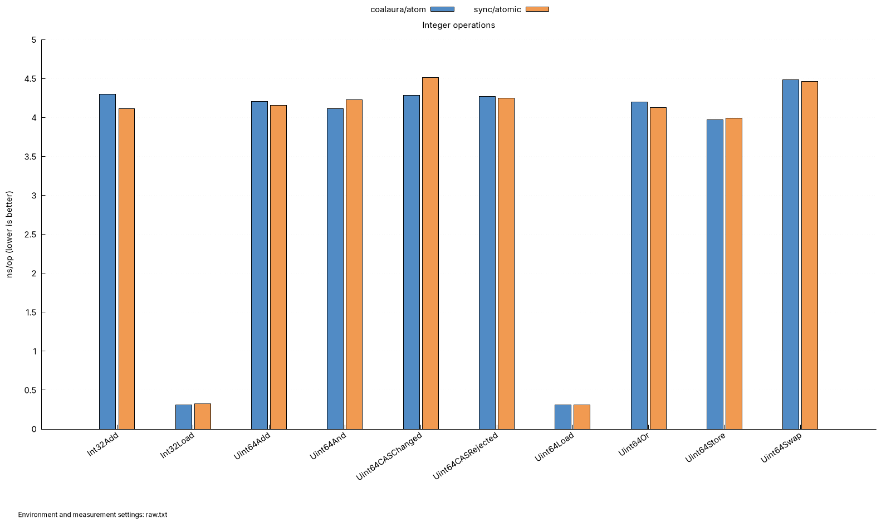
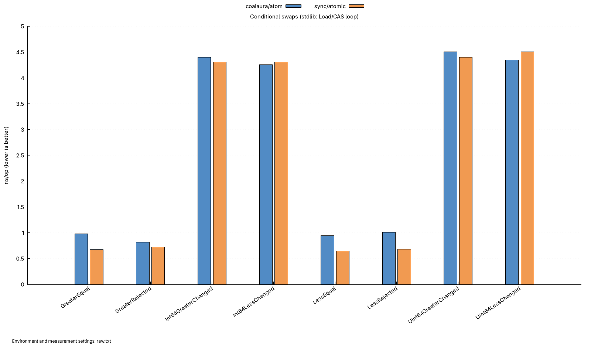
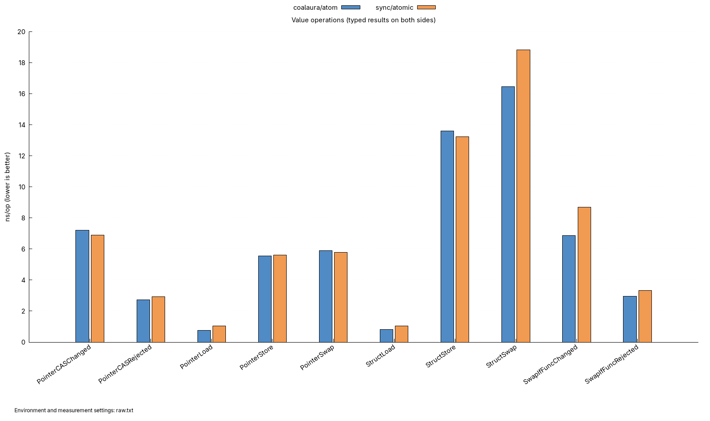
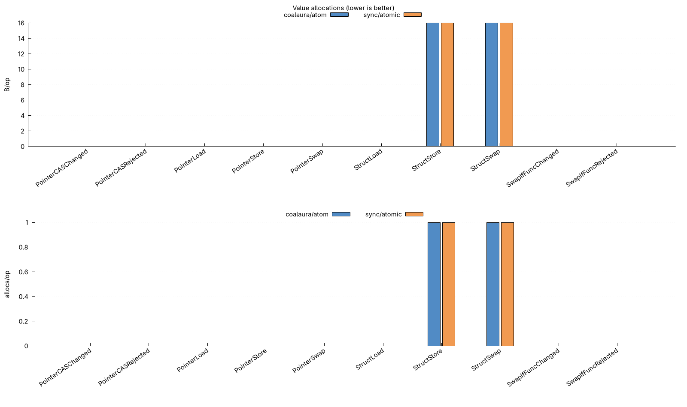
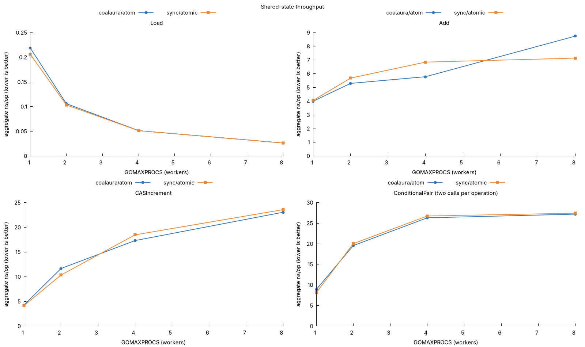

# Benchmarks

Direct, paired comparisons of `github.com/coalaura/atom` with equivalent `sync/atomic` code. One current report lives in `results/`; historical implementations and reports are available in Git history.

## Run

From the repository root, using Go 1.24+, Bash, awk, sort and gnuplot with the `pngcairo` terminal:

```sh
bash bench/run.sh

# Longer measurements, or collect without gnuplot on the benchmark machine.
BENCHTIME=2s bash bench/run.sh
PLOT=false bash bench/run.sh

# Render an existing report from bench/results.
gnuplot ../benchmark.gnuplot

# Repeat selected cases directly with Go's benchmark tooling.
go test ./bench -run='^$' -bench=BenchmarkConditional -benchmem -benchtime=1s -count=5 -cpu=1
```

The script collects one 500 ms sample per implementation and case, using one CPU for serial benchmarks and `CPU=1,2,4,8` for shared-state benchmarks. `BENCHTIME` and `CPU` override those defaults. `raw.txt` records the measurements, toolchain, CPU model and environment; TSV files feed the plots. Re-running replaces the current report. Run on an otherwise idle machine and repeat measurements before drawing conclusions from small differences; these charts are a snapshot, not a statistical significance test.

## Organization and equivalence

| File | Comparison |
| --- | --- |
| `int_test.go` | Uint64 Load, Store, Swap, CAS, Add, And and Or; Int32 Load and Add |
| `conditional_test.go` | Signed/unsigned changing swaps, rejected candidates and equality against typed stdlib CAS loops |
| `value_test.go` | Pointer and struct values against `atomic.Value`, including equivalent typed return assertions and predicate swaps |
| `parallel_test.go` | Shared Load, Add, CAS increment and conditional pairs at multiple worker counts |

Serial cases use `b.Loop()` and `b.ReportAllocs()` with setup outside timing. Calls use concrete types directly, without an interface or callback harness. Changing conditional swaps use monotonic candidates so they keep swapping without a timed reset Store. Narrow atom integers retain 64-bit backing storage; `atomic.Int32` uses 32-bit storage. Pointer fixtures are preallocated and immutable, while struct writes include boxing and allocation. The library and baseline both use Go atomics; run without `-race` for performance measurements.

Parallel cases use `b.RunParallel` and one shared atomic. Their `ns/op` measures aggregate elapsed time per completed operation, not individual latency. Each conditional-pair operation calls less then greater; successful swaps, rejections and retries depend on scheduling. Atom runs before Stdlib within each pair. Benchmarks require Go 1.24 for `b.Loop`; older Go versions skip these files without changing the library's minimum version.

## Current report










